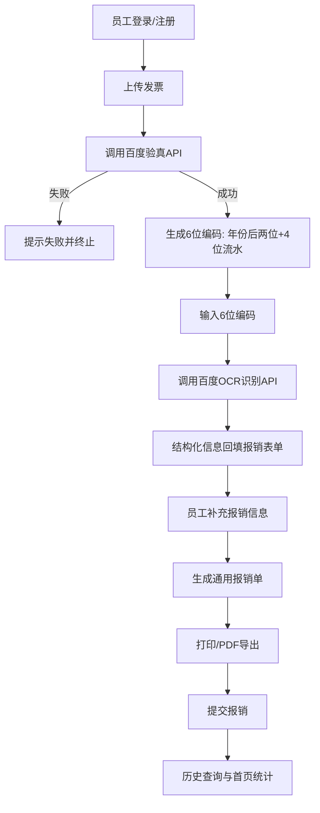
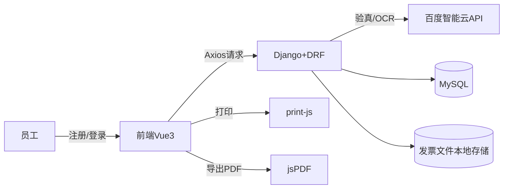

# 系统核心流程图（Mermaid）

```mermaid
flowchart TD
A[员工登录/注册] --> B[上传发票]
B --> C[调用百度验真API]
C -->|失败| D[提示失败并终止]
C -->|成功| E[生成6位编码: 年份后两位+4位流水]
E --> F[输入6位编码]
F --> G[调用百度OCR识别API]
G --> H[结构化信息回填报销表单]
H --> I[员工补充报销信息]
I --> J[生成通用报销单]
J --> K[打印/PDF导出]
K --> L[提交报销]
L --> M[历史查询与首页统计]
```

```mermaid
flowchart LR
U[员工] -->|注册/登录| S[前端Vue3]
S -->|Axios请求| B[Django+DRF]
B -->|验真/OCR| C[百度智能云API]
B --> D[(MySQL)]
B --> E[(发票文件本地存储)]
S -->|打印| P[print-js]
S -->|导出PDF| J[jsPDF]
```
